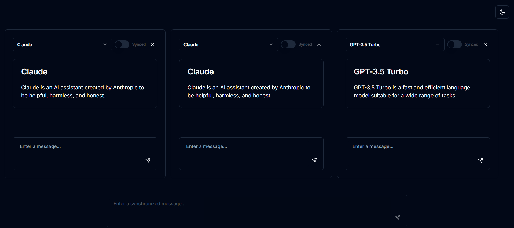

# 🧠 MultiMind AI Runner

A powerful web application for running multiple Large Language Models (LLMs) in parallel, offering a seamless AI interaction experience.



## ✨ Features

- 🚀 Simultaneous use of multiple chat interfaces
- 🔄 Dynamic selection of different LLM models for each chat
- 🔗 Synchronize input across all active chats
- 🌓 Toggle between dark and light modes for comfortable viewing
- 💬 Real-time responses from various AI models

## 🛠️ Technologies Used

- ⚛️ React
- 🔼 Next.js
- 📘 TypeScript
- 🎨 Tailwind CSS
- 🧩 shadcn/ui components
- 🤖 Vercel AI SDK

## 🚀 Getting Started

1. Clone the repository:
   ```
   git clone https://github.com/haseebusman0305/multimindAi.git
   ```

2. Navigate to the project directory:
   ```
   cd multimindAi
   ```

3. Install dependencies:
   ```
   npm install
   ```

4. Set up environment variables (see section below)

5. Start the development server:
   ```
   npm run dev
   ```

6. Open `http://localhost:3000` in your browser and start exploring!

## 🔐 Environment Variables

Before running the application, set up the following environment variables in a `.env.local` file:

```
OPENAI_API_KEY=your_openai_api_key
ANTHROPIC_API_KEY=your_anthropic_api_key
GOOGLE_GEMINI_API_KEY=your_google_gemini_api_key
GROQ_API_KEY=your_groq_api_key
```

## 🔮 Future Enhancements

We're constantly working to improve MultiMind AI Runner. Here are some features on our roadmap:

- 📸 Multimodal support for image and audio inputs
- 📝 Markdown to HTML conversion for rich text formatting
- 💾 Conversation history storage in a database
- ⚙️ Customizable UI elements, including an adjustable message input area
- 📊 Analytics dashboard for usage insights
- 🔒 Enhanced security features

## 🤝 Contributing

We welcome contributions from the community! If you'd like to contribute:

1. Fork the repository
2. Create your feature branch (`git checkout -b feature/AmazingFeature`)
3. Commit your changes (`git commit -m 'Add some AmazingFeature'`)
4. Push to the branch (`git push origin feature/AmazingFeature`)
5. Open a Pull Request

For major changes, please open an issue first to discuss what you would like to change.

## 📄 License

This project is licensed under the MIT License - see the [LICENSE](LICENSE) file for details.

## 🙏 Acknowledgements

- Thanks to all the amazing open-source projects that made this possible
- Shoutout to the AI community for continuous inspiration and support